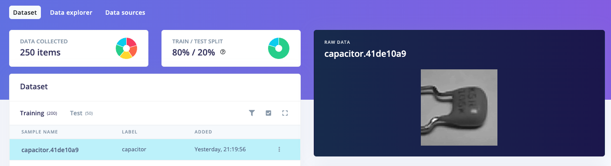
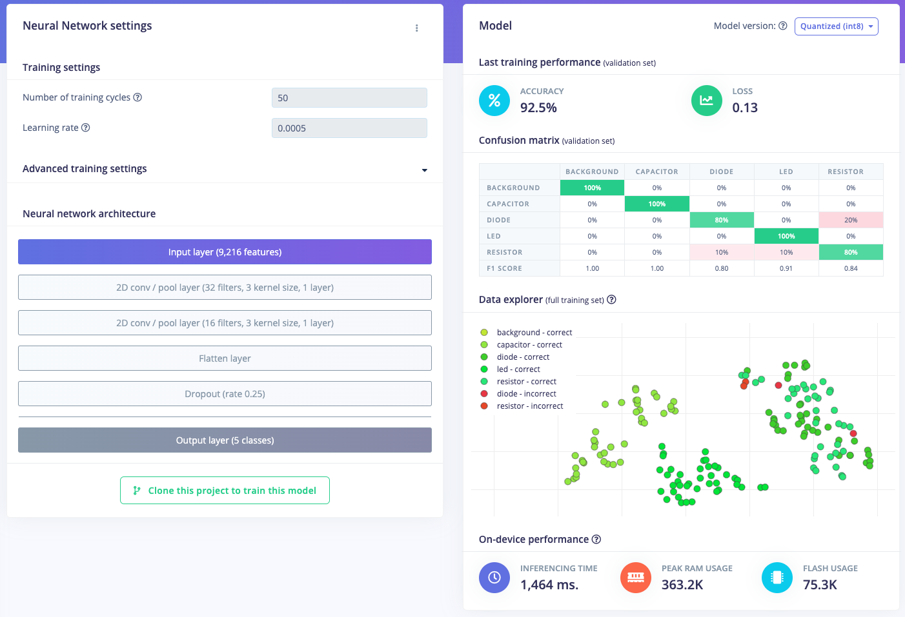
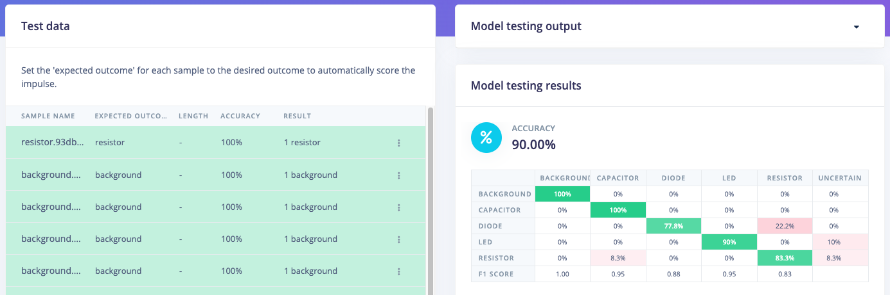
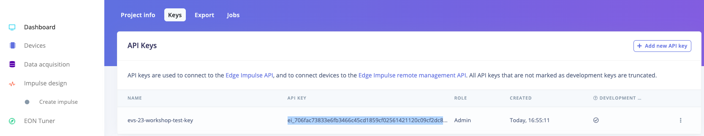
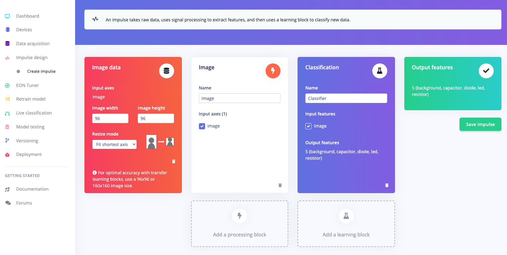
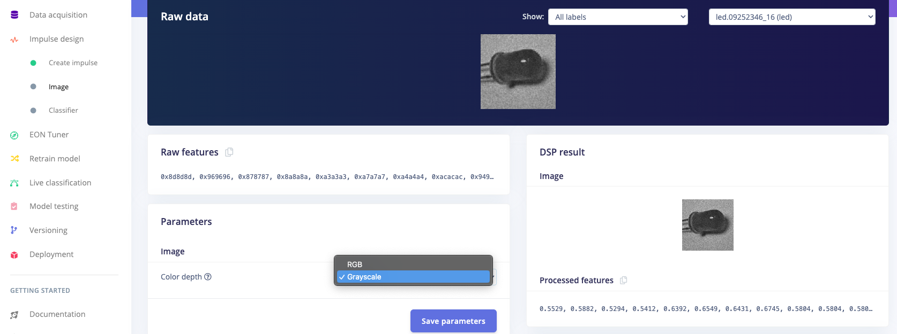
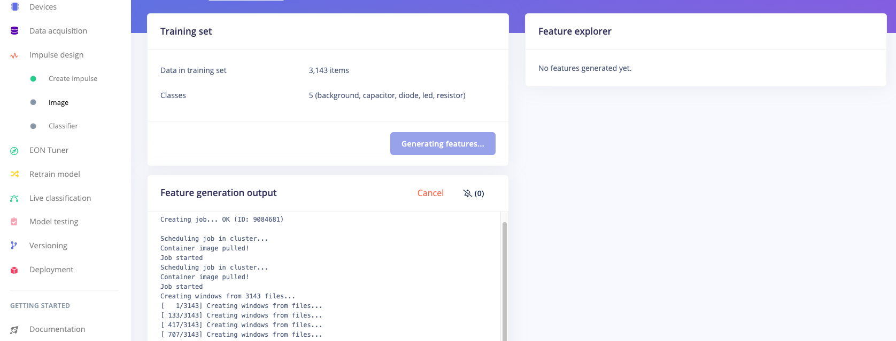
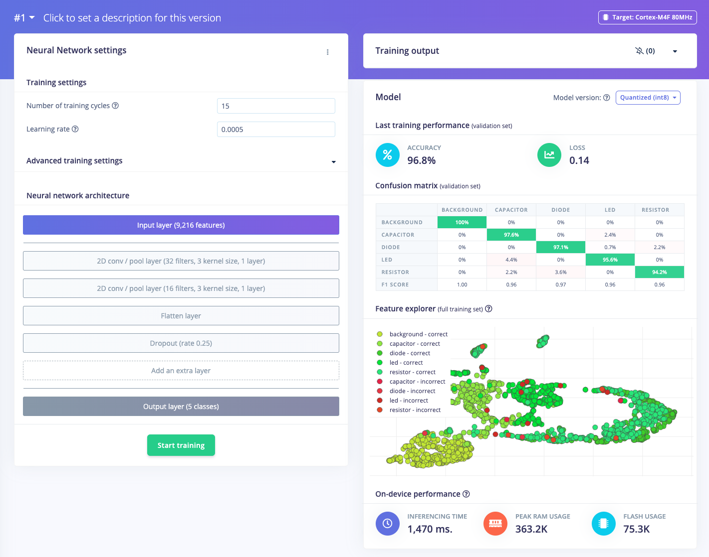
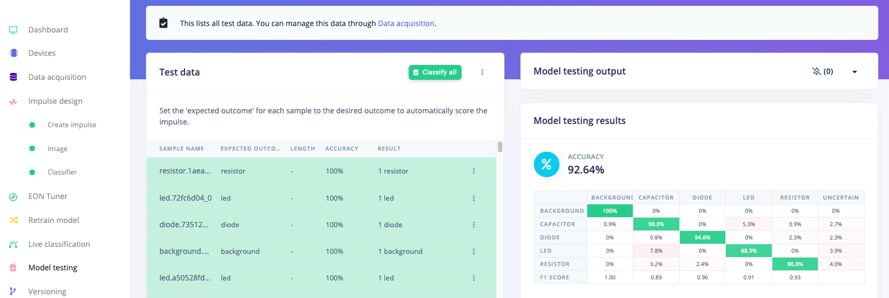

# Image Data Augmentation Workshop

Welcome to the data augmentation workshop for image classification!

## Check initial accuracy

Head to the following Edge Impulse project: [https://studio.edgeimpulse.com/public/226428/latest](https://studio.edgeimpulse.com/public/226428/latest)

Go to the *Data acquisition* page. Note the division of classes and the types of images we are working with. There should be 50 grayscale images with 96x96 resolution each of the following classes:
 * background
 * capacitor
 * diode
 * led
 * resistor

Feel free to look at the *Classifier* page to examine the convolutional neural network architecture. We are using a simple model with 2 convolution (and pooling) layers with a final dense layer to perform image classification. You can see that our classes are fairly easily separated in the *Data explorer*.

While 92.5% may look decent, keep in mind that the accuracy was around 97% on the training set. As a result, we run into a few problems with such a small dataset:
 * Model overfitting (low validation and test accuracy)
 * Model is not robust; it will struggle to generalize to components in different locations, zoom, crop, lighting, etc.

Head to the *Model testing* page and verify that our model is indeed overfit.

## Question: how do we fix overfitting?

Name three ways in which you can fix model overfitting.

We will focus on one possible solution in this workshop: data augmentation.

## Data augmentation

Data augmentation is the process of artificially increasing our dataset by creating modified copies of our original samples.

This works on a variety of data types!
 * Images: crop, translate, rotate, add noise, etc.
 * Audio: add background noise, translate, shift frequencies, drop frequencies, etc.
 * Time series: add noise, translate, drop frequencies, etc. (see [this paper](https://arxiv.org/abs/2002.12478) for more information)

The [dataset in this repository](electronic-components-png-original.zip) is the same found in the public Edge Impulse project you just saw. We are going to augment this dataset and re-train the same model to see how it affects accuracy.

To start, open the [Jupyter Notebook in Colab](https://colab.research.google.com/github/edgeimpulse/workshop-image-data-augmentation/blob/main/image-data-augmentation.ipynb)

Execute each cell by pressing **shift + enter**. Read through the code and comments to broadly understand how we are generating various transformations from a single image. Near the top, you will be asked to copy in the API key from an Edge Impulse project.

Head to [edgeimpulse.com](https://edgeimpulse.com/) and create an account (if you do not already have one). Create a new project. Head to the **Dashboard** page. Go to the **Keys** tab. Double-click to highlight the API key and press **ctrl + c** (Windows and Linux) or **cmd + c** (macOS) to copy the key.

Look for `***YOUR CODE HERE***` comments. You are encouraged to write code to complete the workshop. There are three areas where you will need to write code:
 1. Copy your API key from a new Edge Impulse project
 2. Call a couple of functions to generate augmented images
 3. (Optional challenge) Create at least one compound transformation

The final cells of the notebook will automatically upload your new augmented dataset to Edge Impulse.

When uploading your augmented dataset to your Edge Impulse project, do not worry if you get a few error messages that say `An item with this hash already exists`. Edge Impulse performs a deep inspection of your data to see if any two samples contain the same information. When performing random augmented transformations, there is a good chance we'll end up with two or more samples that look the same.

## Retrain model

In your Edge Impulse project, head to the **Impulse** page. Add an **Image** processing block and a **Classification** learning block. Leave all other parameters at their defaults. Click **Save Impulse**.

Head to the **Image** page. Change the *Color depth* to **Grayscale**. Click **Save parameters**.

You should be taken to the *Generate features* tab. Click **Generate features** and wait while training samples are generated. Note that these samples are the same augmented images we started with; Edge Impulse just needs them in a certain format before training the classifier model.

When that is finished, head to the **Classifier** page. Leave the *Number of training cycles* at **15** so that we can finish training the model in a reasonable amount of time. Leave the other hyperparameters at their defaults. Click **Start training** and wait while the model trains.

Training takes longer, but you can see training a model on more data can be done in fewer epochs, and we get a more accurate model!

Head to the **Model testing** page and click **Classify all**. Once the tests are done, you should hopefully find that your model is more accurate. Note that sometimes the model has a similar accuracy on the test set as when trained with the original dataset. While this may indicate some overfitting, rest assured that your model is still more robust!

## Going further

### Transformation blocks

You can automate this entire process when moving data from an Edge Impulse Organization dataset or from another data store (e.g. AWS) into an Edge Impulse project. Edge Impulse enterprise customers have the option to build custom transformation blocks to convert or augment data as they see fit. See [here](https://docs.edgeimpulse.com/docs/edge-impulse-studio/organizations/research-data/creating-a-transformation-block-dataset) to learn more about transformation blocks.

### Synthetic data generation

While samples generated via data augmentation can be considered a form "synthetic data," true synthetic data is AI generated! Imagine using [text-to-speech](https://cloud.google.com/text-to-speech) to automatically create keyword samples or [DALL-E 2](https://openai.com/product/dall-e-2) to generate images to use in your training set.

If you would like to dig into this concept deeper, our own @jimbruges has a fantastic demo using Google's text-to-speech package to generate words for a keyword spotting dataset. Check out [his video here](https://www.youtube.com/watch?v=AoTB7eRjRiw):

## License

This tutorial (README.md) is licensed under [CC BY-NC-SA 4.0](https://creativecommons.org/licenses/by-nc-sa/4.0/).

Slides are licesned under [CC BY-NC-SA 4.0](https://creativecommons.org/licenses/by-nc-sa/4.0/).

Source code is licensed according to [LICENSE](LICENSE).
